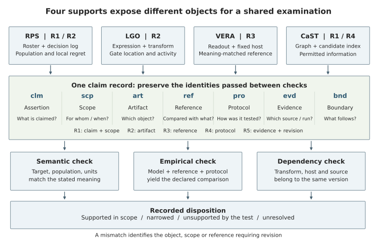

# AuditableAI

**From model outputs to verifiable claims.** Code and selected aggregate evidence for the doctoral dissertation:

> **A Theoretical Framework and Mathematical Models for Auditable AI in Human Sciences: From Model Outputs to Verifiable Claims**  
> Ou Deng · Graduate School of Human Sciences, Waseda University · manuscript v1.0

This repository connects a seven-field claim record to inspectable model expressions, explicit evaluation conditions, executable checks and retained evidence. It contains the dissertation's new clinical, NHANES and Japanese regional-health applications, plus code for regenerating its diagrams and selected analyses of the four supporting studies.

Code version: **1.0.0rc1** · [GitHub repository](https://github.com/oudeng/AuditableAI).

## What can I run?

| Route | Inputs | What it establishes |
|---|---|---|
| Offline demonstration and tests | Included artificial examples | Check execution, native-unit export equivalence and specific missing dependencies |
| Reported-evidence figures | Included aggregate CSV/JSON | Recalculate selected statistics and redraw reported comparisons; no retraining |
| NHANES reproduction | Nine public CDC modules, downloaded and checked | Refit five model families, evaluate the held-out survey cycle and repeat the finite fault benchmark |
| Japanese reproduction | Nine official NDB workbooks and one census workbook | Rebuild the panel, refit six methods, verify source cells, generate 188 records and repeat the post-hoc diagnosis |
| Clinical reproduction | Your authorized MIMIC-IV 3.1 and eICU-CRD 2.0 copies | Extract the 24-hour cohort, refit comparisons and evaluate cross-database transport |

Raw datasets, participant/patient records, restricted-data model weights and the lab's internal NDB dataset package are not distributed. Public sources are downloaded to your local working directory. See [data definitions and access](docs/DATA.md).

## Quick start

Python 3.10 or newer is required; the release checks use Python 3.12 and scikit-learn 1.7.2. Start in the downloaded repository directory:

```bash
python -m venv .venv
source .venv/bin/activate
python -m pip install -r requirements.txt
python -m pip install --no-deps -e .
python scripts/reproduce.py check
python scripts/reproduce.py test
python scripts/reproduce.py demo
python scripts/reproduce.py figures
```

On Windows, activate with `.venv\Scripts\activate`. The launcher sets numerical thread counts before starting child processes. The quick start needs no GPU, patient access or network after installation. Outputs are written under `work/`, which is excluded from version control. The demo is explicitly artificial and is not an additional dissertation experiment.

Use `--workdir /path/to/a/fresh/working-directory` on every command to put outputs elsewhere, or export `AUDITABLEAI_WORKDIR` once. Fitting and verification stages refuse to overwrite completed run directories. Plotting and the artificial demo may refresh their own outputs.

## Framework and scientific scope



Five requirements organize each claim: specify its meaning and scope (R1), expose an inspectable object (R2), choose a meaning-matched reference (R3), retain evaluation conditions (R4), and preserve evidence and revision (R5).

```text
clm  assertion          scp  population / time / units
art  inspectable object ref  comparison reference
pro  evaluation rules   evd  supporting artifacts
bnd  inferential boundary
```

The new applications use an **additive logistic-gate model**, sharing the LGO construction principle. They do not rerun the published LGO genetic-programming algorithm. RPS, VERA and CaST inform evaluation requirements; their four algorithms are not forced into one prediction pipeline. See [framework](docs/FRAMEWORK.md) and [supporting studies](docs/RELATED_WORK.md).

## Results to reproduce

| Dissertation comparison | Recorded result | Interpretation |
|---|---|---|
| MIMIC → eICU, primary fit | Gate Brier 0.0806; boosted trees 0.0786 | Inspectability has a measured accuracy trade-off in this comparison |
| NHANES 2017–2018 | Gate RMSE 1.0053; boosted trees 1.0101; MAE ordering reverses | “Better” depends on the stated metric and evaluated cohort |
| Finite fault benchmark, per application | Omitting scope admits 180 invalid variants; unbinding dependencies admits 90; Full and strong conventional checks each admit 0 of 630 | Specific checks exclude specific errors; this does not show superiority over the strong control |
| Japan FY2022–2023 | Gate MAE 0.7018; persistence 0.2198; damped trend 0.1908 percentage points | The frozen model's failure can be traced through annual errors, gate activity and exact term decomposition |

The 630 invalid variants are dependent engineering cases, not 630 independent real-world incidents. Auditing a fixed model does not itself improve its predictions. The Japanese diagnosis is post-hoc and does not retune the tested models or identify a causal pandemic effect. These qualifications are part of the result. Full-precision values remain in [`evidence/`](evidence/README.md).

## Full reproduction routes

- [Command-by-command reproduction](docs/REPRODUCING.md): public applications, authorized clinical workflow, stage outputs and comparisons.
- [Data documentation](docs/DATA.md): cohorts, units, source versions, download fingerprints and use boundaries.
- [Figure and table map](docs/FIGURE_TABLE_MAP.md): dissertation locators, generators and required inputs.
- [Provenance](docs/PROVENANCE.md): what was copied, what was adapted, source identities and limitations.
- [Validation](docs/VALIDATION.md): checks actually executed for this release candidate.

## Repository layout

```text
src/auditableai/       shared models, finite auditor, seven-field record, paths, plot style
experiments/phase4b/   clinical and NHANES fitting, extraction, audit and replay
experiments/phase4c/   fixed-model time/population/unit illustrations
experiments/japan_health/  source extraction, fitting, source-cell verification, diagnosis
examples/             synthetic demonstration, clearly separated from evidence
figures/              matplotlib + seaborn figure and LaTeX-table generators
scripts/              stage launcher, public-data downloaders and release verification
data_manifests/       official download URLs and expected SHA-256 values
evidence/             selected aggregate reference outputs, not raw datasets
environments/         original environment records
tests/                executable scientific and dependency checks
provenance/           source-to-package map and upstream repository identities
docs/                 reproduction, interpretation and maintenance guidance
```

Names such as `phase4b`, `phase4c`, `formal_v1` and `review1_v1` retain the identifiers used in the dissertation evidence trail. They are stages and snapshots, not additional studies or publication versions.

## Supporting repositories

| Study | Original implementation | Role in this dissertation |
|---|---|---|
| RPS | [oudeng/RPS](https://github.com/oudeng/RPS) | Population and information conditions of performance claims |
| LGO | [oudeng/LGO](https://github.com/oudeng/LGO) | Inspectable gate constructions and conditional unit interpretation |
| VERA | [oudeng/VERA](https://github.com/oudeng/VERA) | References matched to the meaning of an explanation claim |
| CaST | [oudeng/CaST](https://github.com/oudeng/CaST) | Protocol-defined tasks and permitted information |

The inspected commits are recorded in [`provenance/upstream_repositories.json`](provenance/upstream_repositories.json). These links support source-study reproduction; AuditableAI is not a mirror of those repositories. In particular, the dissertation's CaST final five-signal tables are a separately identified snapshot, not a claim that the current upstream README describes exactly that snapshot.

## Citation and license

Citation metadata is in [`CITATION.cff`](CITATION.cff). Cite the dissertation and the relevant original studies when using their methods or results. The dissertation remains a draft under professor review; no university acceptance date is implied by this software version.

Software and its accompanying repository documentation use the **MIT License**. Source datasets and original publications retain their own terms. No license to restricted data or publisher figures is granted; see [NOTICE](NOTICE.md).

The author directed and reviewed the research and takes responsibility for its claims. AI assistance was used in code development, analysis, documentation and this repository preparation. Machine checks support reproducibility; they are not independent investigator review.
